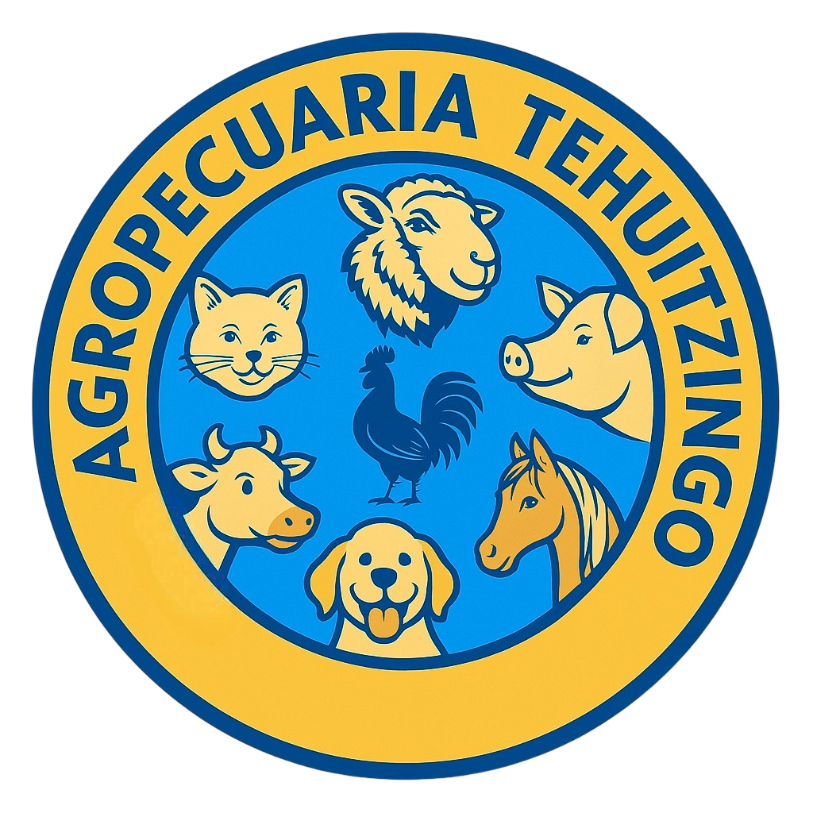

# 🏥 Agropecuaria Tehuitzingo - Plataforma Web

<div align="center">
  
  
  [](https://reactjs.org/)
  [](https://supabase.com/)
  [](LICENSE)
</div>

## 📋 Descripción del Proyecto

**Agropecuaria Tehuitzingo** es una plataforma web moderna desarrollada en React que ofrece una solución integral para la gestión y comercialización de productos veterinarios y agropecuarios. Con más de 20 años de experiencia en el mercado, esta aplicación web permite a los clientes explorar, consultar y gestionar productos relacionados con el cuidado animal.

### 🎯 Características Principales

- **🏪 Catálogo Digital**: Exploración completa de productos organizados por categorías
- **🛒 Gestión de Productos**: Sistema de administración para inventario y ofertas
- **👥 Autenticación de Usuarios**: Sistema de registro y login seguro
- **📱 Diseño Responsivo**: Interfaz adaptada para dispositivos móviles y desktop
- **🔍 Búsqueda Avanzada**: Filtros y búsqueda inteligente de productos
- **📧 Contacto Integrado**: Formularios de contacto y comunicación directa

### 🏷️ Categorías de Productos

- **Alimentos Balanceados**: Nutrición especializada para todas las especies
- **Medicamentos Veterinarios**: Productos farmacéuticos de calidad
- **Mascotas**: Alimentos y accesorios para mascotas
- **Implementos**: Herramientas y equipamiento agropecuario

## 🚀 Tecnologías Utilizadas

- **Frontend**: React 19.1.0, React Router DOM
- **Backend**: Supabase (Base de datos y autenticación)
- **UI/UX**: CSS3, React Icons, Lucide React
- **Comunicación**: EmailJS para formularios de contacto
- **Despliegue**: Optimizado para producción

## 📦 Instalación y Configuración

### Prerrequisitos

- Node.js (versión 16 o superior)
- npm o yarn

### Pasos de Instalación

1. **Clonar el repositorio**
   ```bash
   git clone https://github.com/tu-usuario/agropecuaria-tehuitzingo.git
   cd agropecuaria-tehuitzingo
   ```

2. **Instalar dependencias**
   ```bash
   npm install
   ```

3. **Configurar variables de entorno**
   ```bash
   # Crear archivo .env en la raíz del proyecto
   REACT_APP_SUPABASE_URL=tu_url_de_supabase
   REACT_APP_SUPABASE_ANON_KEY=tu_clave_anonima_de_supabase
   REACT_APP_EMAILJS_PUBLIC_KEY=tu_clave_publica_de_emailjs
   ```

4. **Ejecutar en modo desarrollo**
   ```bash
   npm start
   ```

5. **Abrir en el navegador**
   ```
   http://localhost:3000
   ```

## 🛠️ Scripts Disponibles

| Comando | Descripción |
|---------|-------------|
| `npm start` | Ejecuta la aplicación en modo desarrollo |
| `npm run build` | Construye la aplicación para producción |
| `npm test` | Ejecuta las pruebas unitarias |
| `npm run eject` | Expone la configuración de webpack (irreversible) |

## �� Estructura del Proyecto

```
src/
├── assets/           # Imágenes y recursos estáticos
├── auth/            # Configuración de autenticación
├── components/      # Componentes reutilizables
├── lib/            # Configuración de Supabase
├── pages/          # Páginas principales de la aplicación
└── App.js          # Componente principal
```

## 🎨 Características de la Interfaz

- **Diseño Moderno**: Interfaz limpia y profesional
- **Navegación Intuitiva**: Menús organizados por categorías
- **Responsive Design**: Adaptable a todos los dispositivos
- **Accesibilidad**: Cumple con estándares de accesibilidad web

## 🔐 Funcionalidades de Seguridad

- Autenticación segura con Supabase
- Rutas protegidas para usuarios autenticados
- Panel de administración con permisos especiales
- Recuperación de contraseñas por email

## 📞 Contacto y Soporte

Para más información sobre Agropecuaria Tehuitzingo:

- **Ubicación**: Tehuitzingo, México
- **Servicios**: Veterinaria, Alimentos Balanceados, Medicamentos
- **Experiencia**: 20+ años en el mercado

## 🤝 Contribuciones

Las contribuciones son bienvenidas. Para contribuir:

1. Fork el proyecto
2. Crea una rama para tu feature (`git checkout -b feature/AmazingFeature`)
3. Commit tus cambios (`git commit -m 'Add some AmazingFeature'`)
4. Push a la rama (`git push origin feature/AmazingFeature`)
5. Abre un Pull Request

## 📄 Licencia

Este proyecto está bajo la Licencia MIT. Ver el archivo `LICENSE` para más detalles.

## 🙏 Agradecimientos

- **React Team** por el framework
- **Supabase** por la infraestructura backend
- **Comunidad Open Source** por las librerías utilizadas

---

<div align="center">
  <p><strong>Agropecuaria Tehuitzingo</strong> - Tu confianza, nuestro compromiso</p>
  <p>Desarrollado con ❤️ para el bienestar animal</p>
</div>
